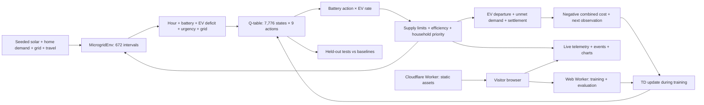
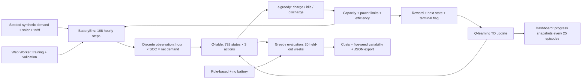

# Volt Lab

A reinforcement learning studio for solar battery control and a joint-action EV microgrid. Build intuition by watching a real tabular Q-learning agent train, replaying its decisions, inspecting its Q-values, and comparing it with a rule-based controller.

## Run

Requires Node.js 20 or newer. The browser app has no application dependencies. Install development dependencies with npm install to use Wrangler.

```sh
npm start
```

Open http://localhost:5173. Use PORT to choose another port. The server binds to all interfaces for preview compatibility; it is a local development server, not a production host. The app can also be served as static files on a host that supports ES modules and Web Workers. Optional Google Fonts fall back to locally available fonts when offline.

## Microgrid demo

Open /?lab=microgrid or choose **Microgrid lab**. Start live telemetry, step through 15-minute intervals, and compare learned, rule-based, and no-battery controllers. Use **Grid outage** and **EV departure** to advance through the actual physics to those moments. Choose cloudy or outage scenarios, train a fresh joint policy, and inspect held-out evaluation. **Share scenario** copies the scenario URL; each friend loads the reference model and runs their own simulation. Export JSON to save your trained model and telemetry.

Live means simulated telemetry generated at selectable 0.5×, 1×, 2×, and 4× speeds. Normal speed advances one 15-minute interval per second. It is not connected-device data or a shared server session. Cloudflare serves static assets; simulation and training execute in each visitor’s browser. Reload restores the reference policy.

## Microgrid environment contract

- Seven days × 96 intervals = 672 steps; each lasts 15 minutes.
- Stationary battery: 10 kWh, initial 5 kWh, 3 kW power limit, 95% efficiency in each direction.
- EV: 40 kWh capacity, initial 24 kWh, goal 32 kWh (80%) at 07:00. Home from 18:00 to 07:00; daily synthetic travel consumes 10–17 kWh. Charging rates: off, 1.8 kW, and 3.6 kW, with 92% efficiency.
- Nine joint actions combine three battery actions with three EV charging rates.
- Grid import limit: 5 kW. Essential household demand has priority over EV charging and battery charging. Surplus solar is curtailed; no export revenue.
- Mixed and cloudy scenarios have one one-hour evening outage. The outage stress test has three-hour interruptions on days 3 and 6.
- Approximate observation: hour × six battery SOC buckets × three EV deficit buckets × three net-demand buckets × three urgency categories × grid availability = 7,776 states. The table has 69,984 action values. Minute, exact charge, day, and future weather are omitted.
- Reward is the negative interval objective: grid bill + battery wear ($0.015/kWh moved) + carbon cost ($0.05/kg) + unserved household penalty ($4/kWh) + EV shortfall penalty ($2/kWh). Terminal settlement values the difference from initial battery and EV energy at $0.12/kWh. These prices and penalties are modeling choices.
- α = 0.2, γ = 0.995; ε decays from 1 to 0.05 over the first 80% of training. Empty Q-tables break greedy ties by idling the battery and leaving EV charging off.
- Training seed × 100,000 + episode determines each mixed-weather training week. Validation uses seeds 810000001–810000002; testing uses 910000001–910000010 in each profile. Live scenarios use 920000001–920000003.
- Curves summarize blocks of 50 episodes; validation averages two fixed weeks. Final evaluation averages ten held-out weeks per profile. Partial training never replaces the completed policy or results.
- The 6,000-episode reference budget was selected using separate validation comparisons with 12,000 and 24,000 episodes. It is one training seed, not a multi-seed performance claim.

The mixed-weather reference objective is **$40.83/week** for Q-learning, **$37.54** for the rule-based controller, and **$62.21** without the stationary battery. Q-learning produces 100.7 kg of modeled grid emissions versus 112.6 kg for the rule, while EV departure readiness is 98.6% versus 100%. The rule wins the combined objective; the dashboard preserves that result.



## Cloudflare Workers deployment

Live demo: [Volt Lab microgrid](https://volt-lab-rl-studio.arsh9bl998.workers.dev/?lab=microgrid).

A new assets-only Worker named **volt-lab-rl-studio**, configured in wrangler.jsonc, serves only the public files copied into dist/. Node’s development server is not deployed.

```sh
npm install
npm run build
npx wrangler deploy --dry-run
npm run deploy
```

Wrangler uses your authenticated Cloudflare account; credentials are never included in public assets. For a different account, update account_id and choose your own Worker name. Hosting uses workers.dev. The build includes security headers and excludes tests, screenshots, node_modules, and local configuration. No database or server-side training service is required.

## Microgrid verification and files

```sh
npm test
node scripts/microgrid-reference.mjs
node scripts/verify-microgrid-ui.mjs
```

The optional browser test uses the same Playwright setup as the battery test below. Both accept BASE_URL to verify a published Worker. Microgrid checks include live stepping, outage/departure events, training pause/resume, stable evaluation, JSON export, scenario sharing, and mobile layout.

- src/microgrid.mjs — joint-action physics, scenarios, Q-learning, and evaluation.
- src/microgrid-worker.mjs — asynchronous policy training.
- src/microgrid-view.mjs — live telemetry, controls, events, and results.
- src/microgrid-reference.json — actual 6,000-episode policy.
- scripts/microgrid-reference.mjs — reproduce the reference experiment.
- scripts/build.mjs and wrangler.jsonc — packaging and deployment.

## Battery demo in three minutes

1. Open **Environment** and play the seven-day replay. Scrub the timeline, switch controllers, change weather, and inspect the chosen action and learned Q-values.
2. Open **Training lab**, choose a seed and budget, and train. Pause and resume. Explain how exploration decays while the Q-table changes.
3. Open **Evaluation** and compare weekly costs. Run the five-seed benchmark to show the variation between independently trained agents.
4. Open **How it works** to walk through the architecture flowchart.
5. Open **RL field guide** to search the 29 concepts. Export the run as JSON to retain the settings, Q-table, learning curve, and results.

The initial dashboard displays an actual reproducible training run, generated by scripts/reference.mjs. It is not an animated mock. New training happens in a background browser worker. Runs remain in memory; reload restores the reference run. Export before reloading to retain an experiment.

## Architecture



### Environment contract

- Battery: 10 kWh; maximum grid-side charging/discharging power: 2.5 kW; each step: 1 hour.
- Each charge/discharge direction has 95% efficiency (90.25% round-trip).
- Action 0 charges, 1 idles, 2 discharges. Impossible power is physically clipped. Discharge cannot exceed the house's remaining demand. Surplus solar is curtailed; there is no export payment.
- State: 24 hours × 11 rounded SOC buckets × 3 net-demand buckets = 792 states. This is an approximate state representation: day index and hidden weather variation are omitted. It is not a fully observed Markov state.
- Reward = −(grid bill + battery wear + terminal energy settlement). Wear is $0.015 per kWh moved through the battery.
- Initial charge is 5 kWh. At the end, settlement adds (5 − final SOC) × $0.12 to cost, avoiding a free initial-energy comparison. This accounting convention is a modeling choice, not an exact market liquidation value.
- The no-battery baseline uses an idle battery; its unchanged SOC means no wear or settlement, so its cost equals the grid bill.
- Terminal transitions use reward alone. Other transitions bootstrap from the maximum next-state Q-value.
- α = 0.25; γ = 0.97; ε decreases from 1 to 0.05 over the first 75% of training.

### Evaluation protocol

Training scenario seed = training seed × 100,000 + episode index. UI training seeds are 42–46 and budgets are 1,200 / 4,000 / 10,000 episodes. Validation uses 800000001–800000003; final testing uses 900000001–900000020. Training choices use a separate seeded PRNG.

The evaluation policy is greedy with ε = 0. Each controller sees identical test scenarios. Cost is an undiscounted weekly objective in USD, including wear and settlement. Learning uses discounted returns; the chart displays undiscounted returns. Training is a mean across each block of 25 episodes; validation is a mean across three fixed weeks. TD error is a mean across steps of the latest training episode. Final evaluation remains pending until training completes.

The five-seed benchmark reports mean and sample standard deviation of each agent's mean test cost. This is training-seed variability, not a confidence interval or a measurement of all scenario uncertainty. Changing replay weather does not retrain the agent or change the held-out benchmark.

At 1,200 episodes, the reference seed 42 obtains $36.19/week versus $43.02 without a battery and $27.86 for the rule-based controller. It saves 15.9% versus no battery but loses to the stronger heuristic. The dashboard shows this honestly. Performance is not guaranteed to improve monotonically with a larger training budget.

## Verification and reproducibility

```sh
npm test
npm run benchmark
node scripts/reference.mjs
```

Tests cover reproducible scenarios, conservation of energy, capacity limits, terminal behavior, fair evaluation, deterministic training, and learning improvement on fixed validation scenarios.

For the optional browser smoke test, install Playwright as a development tool (no runtime dependency), install its Chromium browser, and keep the app running:

```sh
npm install --no-save playwright
npx playwright install chromium
node scripts/verify-ui.mjs
```

## Project map

- src/rl.mjs — seeded scenario generator, battery physics, Q-learning, baselines, evaluation.
- src/worker.mjs — asynchronous training, pause/resume, progress snapshots, five-seed benchmarking.
- src/app.mjs — dashboard, replay, charts, architecture, glossary, experiment export.
- src/reference.json — reproducible actual reference experiment.
- scripts/reference.mjs — regenerate the reference dataset.
- scripts/benchmark.mjs — reproduce the five-seed benchmark in Node.
- scripts/verify-ui.mjs — browser smoke test.
- server.mjs — minimal static development server.

## What this MVP demonstrates

Custom RL environment engineering, physical constraints, observation discretization, reward accounting, TD learning, exploration, reproducible evaluation, baseline comparisons, and explainable visualization. The stack is ES modules, CSS, inline SVG, Web Workers, and Node's built-in HTTP and test APIs.

It does not implement Gymnasium, a neural-network policy, DQN, PPO, SAC, real weather/utility data, an optimizer baseline, or deployment authentication. Tariffs and profiles are synthetic; no real-world savings claim follows from these results.

A sensible next version is a Python Gymnasium adapter with DQN, a stronger optimization baseline, and real held-out demand/solar data. Keep the environment and evaluation contract first; swap the agent second.
