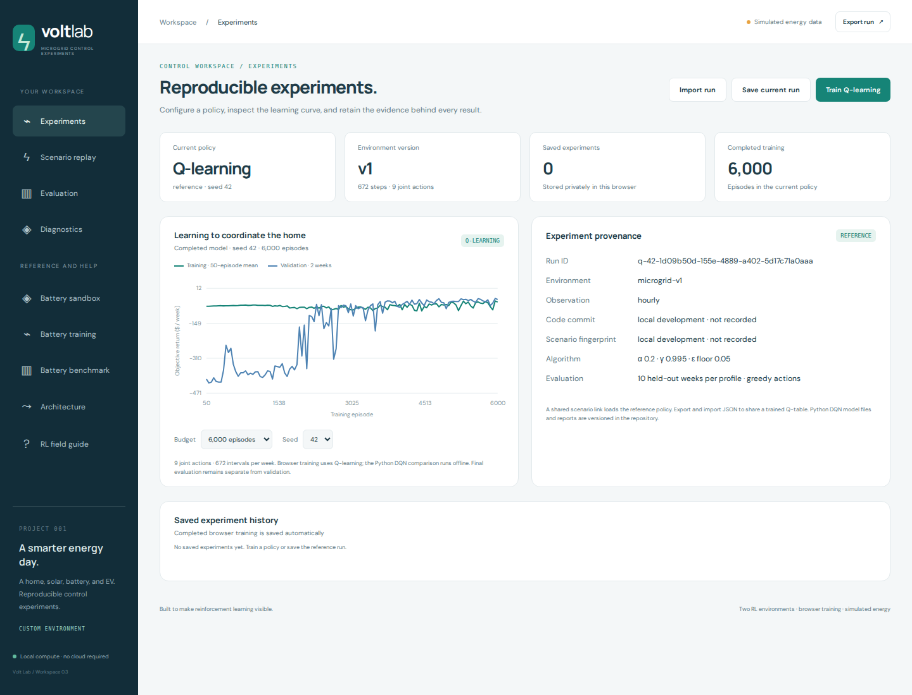
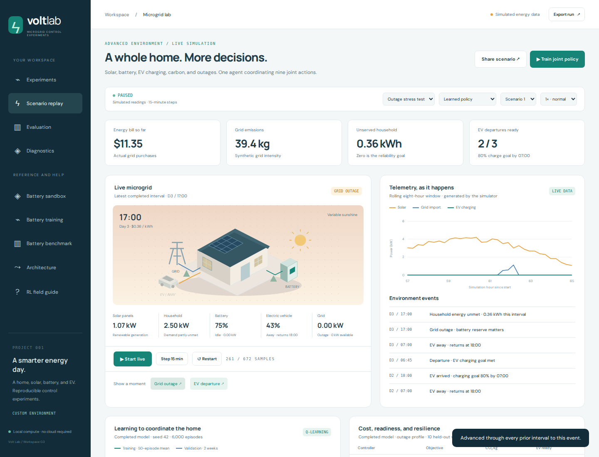
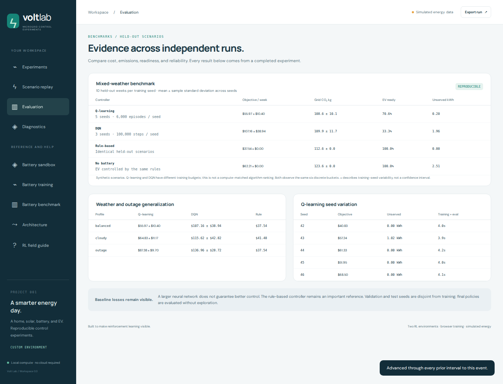
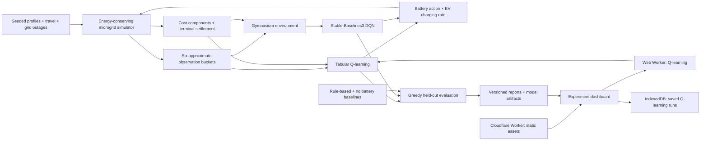

# Volt Lab

**Reinforcement learning for constrained microgrid energy management.**

[Live workspace](https://volt.hiesenbug.dev/) · [Environment contract](docs/environment.md) · [Experiment methodology](docs/experiments.md)

Volt Lab coordinates a stationary battery and EV charging under variable solar generation, time-of-use tariffs, grid import limits, and outages. It combines an energy-conserving simulator, tabular Q-learning, a Gymnasium environment, a Stable-Baselines3 DQN comparison, and a deployed experiment dashboard.

The project investigates whether learned control improves cost, reliability, and charging readiness over a strong tariff-aware heuristic. All published results use synthetic scenarios; baseline losses and training variability remain visible.

## Dashboard preview







## Run the dashboard

Requires Node.js 22 or newer.

```sh
npm ci
npm start
```

Open http://localhost:5173. The default workspace provides experiments, saved policies, held-out benchmarks, and diagnostics. **Scenario replay** shows live simulated 15-minute transitions at 0.5×, 1×, 2×, or 4× speed. The hourly battery sandbox and RL glossary remain under reference/help.

Browser training runs in a Web Worker and saves completed Q-learning experiments to IndexedDB. Reload starts with the reference policy; saved experiments remain available to load. Export/import JSON to transfer a completed Q-table. Scenario links share scenario settings and load the reference policy, not the sender's trained model. Each visitor has independent local state.

## Run the Python environment

The locked CPU environment is verified on Linux x86_64 with Python 3.12. Run from the repository root.

```sh
python3.12 -m venv .venv
.venv/bin/pip install -r requirements.lock
.venv/bin/pip install --no-deps -e .
.venv/bin/pytest -q
```

Use the environment independently:

```python
from volt_lab import MicrogridEnv

env = MicrogridEnv(profile="outage")
observation, info = env.reset(seed=42)
observation, reward, terminated, truncated, info = env.step(8)
env.close()
```

Actions are a Discrete(9) Cartesian product of battery charge/idle/discharge and EV off/slow/fast charging. Python DQN uses six normalized observation buckets containing the same information as the default tabular agent. Full-week parity fixtures verify equivalent JavaScript and Python scenarios, states, transitions, and objectives.

## Reproduce the experiments

```sh
npm run benchmark:microgrid
npm run ablations
.venv/bin/python -m volt_lab.train --timesteps 100000 --seeds 42 43 44
```

Q-learning: five seeds, 6,000 episodes per seed. Ablations: four variants × five seeds at the same budget. DQN: three seeds, 100,000 environment steps per seed. Every final controller is tested greedily on ten held-out weeks per profile; validation and test scenario seeds are separate from training.

Curated reports live in experiments/results/. DQN model ZIP files are in experiments/models/ with SHA-256 hashes in the report. Generated Q-table artifacts go to experiments/local/ and are excluded from Git. The browser ships one reproducible reference Q-table and exposes the aggregate reports.

## Published results

Mixed-weather held-out evaluation. Objectives include grid electricity, wear, carbon cost, missed EV goals, unmet household energy, and terminal settlement.

| Controller            | Objective / week | Grid CO₂ kg / week | EV departures ready | Unserved household kWh / week |
| --------------------- | ---------------: | -----------------: | ------------------: | ----------------------------: |
| Q-learning, 5 seeds   |  $55.97 ± $10.40 |              108.6 |               70.6% |                          0.20 |
| DQN, 3 seeds          | $107.16 ± $38.94 |              109.9 |               33.3% |                          1.96 |
| Rule-based            |           $37.54 |              112.6 |              100.0% |                          0.00 |
| No stationary battery |           $62.21 |              123.6 |              100.0% |                          2.51 |

± is the sample standard deviation across independent training seeds, not a confidence interval. Baselines are deterministic on the fixed scenario set, so repeated training seeds do not create independent baseline samples. Q-learning and DQN have different training budgets; this is not a compute-matched algorithm ranking.

The initial browser reference is seed 42, with a $40.83/week mixed-weather objective. That single policy is intentionally distinguished from the five-seed mean. The heuristic wins the combined objective. DQN at the published budget performs worse, particularly on EV readiness. The reports support environment and evaluation analysis, not a claim of real-world savings or algorithm superiority.

Ablations evaluate every policy under the original objective weights:

| Training variant                            | Common objective / week |
| ------------------------------------------- | ----------------------: |
| Default reward and hourly buckets           |         $55.97 ± $10.40 |
| Remove carbon cost during training          |         $44.75 ± $10.18 |
| Double EV shortfall penalty during training |         $47.38 ± $10.58 |
| Use quarter-hour time buckets               |         $82.55 ± $27.77 |

Removing carbon cost and increasing the EV penalty improved the mean common objective in these fixed experiments, but neither mean beats the heuristic. Finer time buckets expand the table fourfold and perform worse at this budget. These are observed comparisons, not changes selected using the test set.

## Architecture



Cloudflare serves static assets. Simulation and Q-learning training execute in visitors' browsers. Python DQN training runs offline and publishes completed reports and model artifacts; it is not a server-side service exposed by the dashboard.

## Verification

```sh
npm test
npm run format:check
npm run build
npx playwright install chromium
npm start
# In another terminal:
npm run test:browser

.venv/bin/ruff check python
.venv/bin/ruff format --check python
.venv/bin/pytest -q
```

JavaScript tests cover energy balance, device/grid limits, departure timing, reproducibility, terminal accounting, playback cadence, artifact validation, report/model integrity, and static-server boundaries. Python checks include Gymnasium/SB3 validation, full-week cross-language parity, and DQN model restoration. Three browser suites cover training, evaluation, persistence, malformed imports, sharing, exports, replay, responsive layout, and browser errors. BASE_URL can point browser verification at the published Worker.

A GitHub Actions workflow is prepared locally with pinned action revisions and locked dependencies. It is intentionally excluded from the repository until workflow authorization is enabled. The commands above run all checks locally.

## Project structure

```text
src/microgrid/       scenarios, physics, Q-learning, policies, evaluation
src/experiments/     artifact schema, statistics, IndexedDB persistence
src/ui/              charts, scene, view components, reference/help
src/app.mjs          navigation and browser orchestration
python/volt_lab/     Gymnasium API, matching physics, DQN experiments
shared/parity.json  complete JavaScript/Python transition fixtures
experiments/results/ curated multi-seed reports
experiments/models/  saved DQN policies
scripts/             builds, experiment runners, browser verification
tests/               JavaScript behavior and integrity checks
python/tests/        environment and DQN checks
```

## Deployment

```sh
npm run deploy
```

The public dashboard is hosted at https://volt.hiesenbug.dev/. Its custom domain is connected to the volt-lab-rl-studio Worker in Cloudflare. Wrangler builds and deploys the explicit public assets to that Worker. The build records the Git commit plus environment/scenario source hashes in the dashboard's metadata. Tests, local training artifacts, credentials, Python files, and dependency directories are excluded from the deployment. Use your own Cloudflare account and Worker name when deploying a fork.

## Scope and limitations

- Profiles, tariffs, trips, outages, and carbon intensity are synthetic.
- Observations are approximate and omit day, remaining horizon, exact charge, and hidden weather. The simulator's full internal state is not exposed as a fully observed Markov state.
- Household demand has priority over EV and stationary battery charging. Actions are clipped to physical supply; excess solar is curtailed. There is no export revenue, bidirectional EV discharge, thermal model, or real device integration.
- Reward weights and terminal energy valuation are explicit modeling choices.
- The DQN comparison uses the same information and physics, but a substantially different training budget.
- Browser experiment storage is local to one browser profile, without shared accounts or server persistence.
- The study does not establish statistical significance or real-world energy savings.
